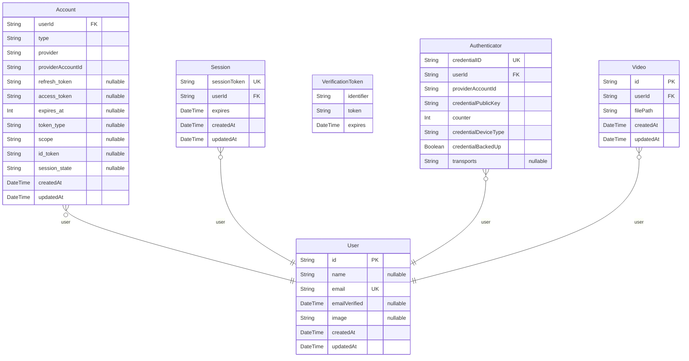

# ER図

> Generated by [`prisma-markdown`](https://github.com/samchon/prisma-markdown)

- [default](#default)

## default

### `User`

Properties as follows:

- `id`:
- `name`:
- `email`:
- `emailVerified`:
- `image`:
- `createdAt`:
- `updatedAt`:

### `Account`

Properties as follows:

- `userId`:
- `type`:
- `provider`:
- `providerAccountId`:
- `refresh_token`:
- `access_token`:
- `expires_at`:
- `token_type`:
- `scope`:
- `id_token`:
- `session_state`:
- `createdAt`:
- `updatedAt`:

### `Session`

Properties as follows:

- `sessionToken`:
- `userId`:
- `expires`:
- `createdAt`:
- `updatedAt`:

### `VerificationToken`

Properties as follows:

- `identifier`:
- `token`:
- `expires`:

### `Authenticator`

Properties as follows:

- `credentialID`:
- `userId`:
- `providerAccountId`:
- `credentialPublicKey`:
- `counter`:
- `credentialDeviceType`:
- `credentialBackedUp`:
- `transports`:

### `Video`

Properties as follows:

- `id`:
- `userId`:
- `filePath`:
- `createdAt`:
- `updatedAt`:
